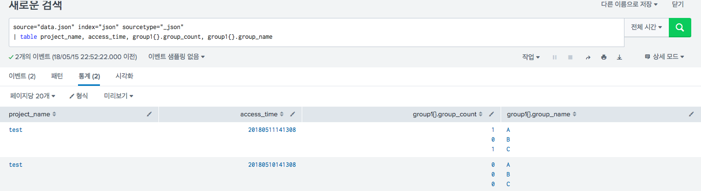
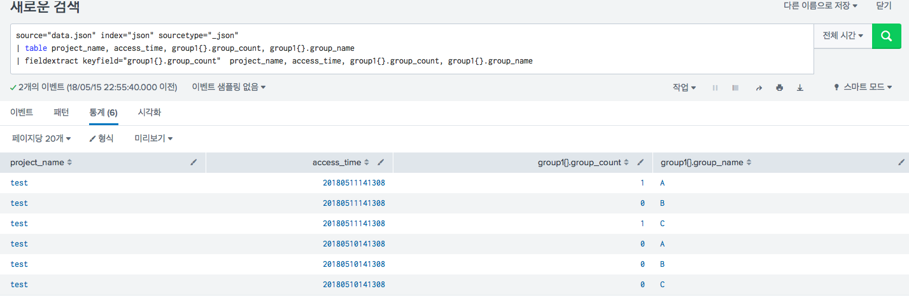

# Field Extract

- splunk 에서 아래의 형식처럼 된 데이터는 필드를 나누는 것이 어려움이 있어서 (복잡한 과정을 거치면 되지만) 명령어로 만들었습니다.
- 물론 속도의 문제는 있을 수 있습니다. 적은 데이터에 대해서 사용하여야 합니다.


## 결과

### 적용 전



### 적용 후




## 사용법

- keyfield를 이용해서 각 이벤트의 반복횟수를 지정합니다.

  ```sql
  source="data.json" index="json" sourcetype="_json"
  | table project_name, access_time, group1{}.group_count, group1{}.group_name
  | fieldextract keyfield="group1{}.group_count"  project_name, access_time, group1{}.group_count, group1{}.group_name
  ```

  